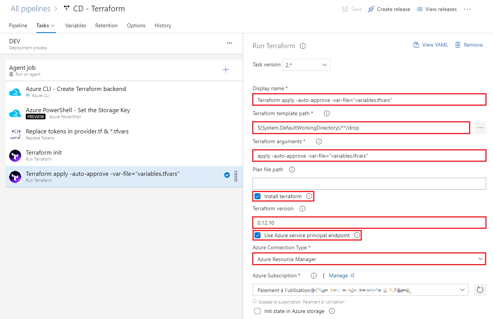

# Déployer un process Logic App avec Azure DevOps & Terraform

Dans cet article, nous allons voir comment déployer un process **Logic App** avec **Terraform** et **Azure DevOps**, de manière automatisée et continue.

Pour rappel, LogicApp est un service Azure qui permet de créer des workflows, d'automatiser l'exécution de processus métier, d'intégrer une multitude de composants entre eux, à l'image de _Biztalk_ et _Worflow Fondation_. Nous ne couvrerons pas la façon de créer des LogicApps mais un exemple Helloword déjà implémenté sera fourni.

💡 Remarque : le service LogicApp n'est pas disponible sur toutes les régions. Nous utiliserons donc la région WestEurope (Ireland) pour nos tests.

Pour bien débuter avec Terraform, je vous recommande la lecture de l'article suivant :

- [Comment utiliser Terraform dans Azure DevOps](https://blog.cellenza.com/devops/comment-utiliser-terraform-dans-azure-devops/)

## Pré-requis

Ce dont nous aurons besoin :

- [Azure CLI](https://docs.microsoft.com/fr-fr/cli/azure/install-azure-cli-windows?view=azure-cli-latest)
- [Terraform](https://chocolatey.org/packages/terraform)
- [Visual Studio 2019](https://visualstudio.microsoft.com/vs/)
- [Azure Logic Apps Tools for Visual Studio 2019 extension](https://marketplace.visualstudio.com/items?itemName=VinaySinghMSFT.AzureLogicAppsToolsForVS2019)
- [Compte Azure DevOps](https://azure.microsoft.com/fr-fr/services/devops/)

## Logic Apps

Les sources sont disponibles à [cette adresse](https://github.com/dhabierre/LogicAppTerraform).

Création d'un Logic App avec un trigger de type HTTP, c'est à dire, un worflow qui sera déclenché par un appel HTTP.

Commençons par créer un nouveau projet de type **Azure Resource Group** :


Puis sélectionnons le template **Logic App** :


Dans le **Solution Explorer**, ouvrons le **Designer** en faisant un clic droit sur **LogicApp.json** puis **Open With Logic App Designer** (ou _Ctrl_ + _L_).

Voici notre petit workflow :)


- Step 1 : déclencheur HTTP sur méthode POST, avec un body _{ "name": "value" }_,
- Step 2 : création d'une variable _Message_ et affectation de sa valeur,
- Step 3 : réponse retour au destinataire.

💡 Remarques

- le visuel **fx parameters(...)** dans le bloc _Initialize variable_ correspond à la valeur du paramètre _environment_ qui sera passé en paramètre du Logic App (cf. fichier _LogicApp.json_),
- l'endpoint HTTP du Logic App sera connu lors du déploiement de celui-ci sur Azure ; nous verrons par la suite comment le récupérer depuis le KeyVault.

Le Logic App prend en entrée différents paramètres. Dans notre exemple, nous utiliserons le paramètre _environment_ dans le message retour. Ces paramètres seront définis dans la Release LogicApps d'Azure DevOps.

```json
{
  "$schema": "https://schema.management.azure.com/schemas/2015-01-01/deploymentTemplate.json#",
  "contentVersion": "1.0.0.0",
  "parameters": {
    "application": {
      "type": "string",
      "defaultValue": "logicapps"
    },
    "environment": {
      "type": "string",
      "defaultValue": "dev"
    },
    "location": {
      "type": "string",
      "defaultValue": "westeurope"
    },
    "logicAppName": {
      "type": "string",
      "minLength": 1,
      "maxLength": 80
    }
  },
  "variables": {},
  "resources": [
    ...
  ],
  "outputs": {}
}
```

## Terraform

### Terraform sous Windows

Cette étape n'est pas obligatoire pour la suite de l'article. A suivre uniquement si vous souhaitez tester la stack Terraform en local, avant de passer par Azure DevOps.

1. Installation de Chocolatey

```powershell
# Powershell (administrator)

Set-ExecutionPolicy Bypass -Scope Process -Force; iex ((New-Object System.Net.WebClient).DownloadString('https://chocolatey.org/install.ps1'))
```

Source : https://chocolatey.org/install

2. Installation de Terraform

```powershell
# Powershell (administrator)

choco install terraform --version 0.12.10
```

Source : https://chocolatey.org/packages/terraform

💡 Remarque : nous forçons la version pour être en accord avec la version spécifiée dans le fichier **provider.tf** (que nous allons voir très bientôt). Vous pouvez installer la dernière version (sans spécifier la version). Dans ce cas, pensez à modifier le fichier **provider.tf** en conséquence.

Ouvrons un nouveau terminal et vérifions que le binaire Terraform est bien dans le PATH :

```powershell
terraform.exe --version
```

La version s'affiche, Good ! 😃

### Définition de la stack Terraform

Commençons tout d’abord par définir l’infrastructure Azure.

### provider.tf

Le rôle de ce fichier est de spécifier la version de Terraform et du provider AzureRM à utiliser lors de l’exécution de la stack.

Voici sa forme la plus simpliste (évolutions prévues par la suite) :

```terraform
provider "azurerm" {
  version = "= 1.35.0"
}

terraform {
  required_version = "= 0.12.10"
}
```

Je prends l'habitude de spécifier la version de Terraform aussi bien dans ce fichier que côté Azure DevOps pour éviter tout effet de bord lors des montées de version.

### main.tf

Ce fichier contient la définition des différentes ressources Azure à déployer.

💡 Remarque : nous faisons intervenir la ressource **azurerm_key_vault** car nous l'utiliserons pour stocker, de manière automatique et sécurisée, l'enpoint HTTP du Logic App.

```terraform
data "azurerm_client_config" "current" {}

locals {
  subscription_id = data.azurerm_client_config.current.subscription_id
  domain          = "${var.application}-${var.environment}"
  
  # add new entries at the end of the array otherwise Terraform will destroy and recrete LogicApps containers
  logicapp_names = [ "hello" ]
	
  app_tags = {
    application  = var.application
    deployment   = "terraform"
    environment  = var.environment
  }
}

# ======================================================================================
# Resource Group
# ======================================================================================

resource "azurerm_resource_group" "app_resource_group" {
  location = var.location
  name     = local.domain
  tags     = local.app_tags
}

# ======================================================================================
# Storage Account
# ======================================================================================

resource "azurerm_storage_account" "storage_account" {
  account_replication_type = "LRS"
  account_tier             = "Standard"
  account_kind             = "StorageV2"
  location                 = azurerm_resource_group.app_resource_group.location
  name                     = "${replace(local.domain, "-", "")}sa"
  resource_group_name      = azurerm_resource_group.app_resource_group.name
  tags                     = local.app_tags
}

# ======================================================================================
# KeyVault
# ======================================================================================

resource "azurerm_key_vault" "key_vault" {
  name                        = "${local.domain}-keyvault"
  location                    = azurerm_resource_group.app_resource_group.location
  resource_group_name         = azurerm_resource_group.app_resource_group.name
  tenant_id                   = data.azurerm_client_config.current.tenant_id
  enabled_for_disk_encryption = true
  sku_name                    = "standard"

  access_policy {
    tenant_id = data.azurerm_client_config.current.tenant_id
    object_id = data.azurerm_client_config.current.service_principal_object_id
  
    key_permissions = [
      "get",
      "list",
      "create",
      "delete",
    ]
  
    secret_permissions = [
      "get",
      "list",
      "set",
      "delete",
    ]
  }

  lifecycle {
    ignore_changes = [access_policy]
  }

  tags = local.app_tags
}

# ======================================================================================
# Logic Apps
# ======================================================================================

resource "azurerm_logic_app_workflow" "logic_app_workflow" {
  count               = length(local.logicapp_names)
  name                = "${local.domain}-logic-app-${element(local.logicapp_names, count.index)}"
  location            = azurerm_resource_group.app_resource_group.location
  resource_group_name = azurerm_resource_group.app_resource_group.name
  tags                = local.app_tags

  lifecycle {
    ignore_changes = [ parameters, tags ]
  }
}

resource "azurerm_log_analytics_workspace" "log_analytics_workspace" {
  name                = "${local.domain}-log-analytics-workspace"
  location            = azurerm_resource_group.app_resource_group.location
  resource_group_name = azurerm_resource_group.app_resource_group.name
  sku                 = "PerGB2018"
  retention_in_days   = 30
  tags                = local.app_tags
}

resource "azurerm_monitor_diagnostic_setting" "monitor_diagnostic_setting_workflow" {
  count                      = length(local.logicapp_names)
  name                       = "${local.domain}-monitor-diagnostic-setting-workflow-${element(local.logicapp_names, count.index)}"
  log_analytics_workspace_id = azurerm_log_analytics_workspace.log_analytics_workspace.id
  target_resource_id         = element(azurerm_logic_app_workflow.logic_app_workflow.*.id, count.index)
  storage_account_id         = azurerm_storage_account.storage_account.id

  log {
    category = "WorkflowRuntime"
    enabled  = true

    retention_policy {
      enabled = true
      days    = 7
    }
  }

  metric {
    category = "AllMetrics"

    retention_policy {
      enabled = true
      days    = 7
    }
  }
}

resource "azurerm_log_analytics_solution" "log_analytics_solution" {
  solution_name         = "LogicAppsManagement"
  location              = "${azurerm_resource_group.app_resource_group.location}"
  resource_group_name   = "${azurerm_resource_group.app_resource_group.name}"
  workspace_resource_id = "${azurerm_log_analytics_workspace.log_analytics_workspace.id}"
  workspace_name        = "${azurerm_log_analytics_workspace.log_analytics_workspace.name}"

  plan {
    publisher = "Microsoft"
    product   = "OMSGallery/LogicAppsManagement"
  }
}
```

### variables.tf

Ce fichier défini les différentes variables :

```terraform
variable "location" {
  type = string
}

variable "application" {
  type = string
}

variable "environment" {
  type = string
}
```

### variables.tfvars

Il est question ici d’affecter les valeurs des variables :

```terraform
location = "__location__"
application = "__application__"
environment = "__environment__"
```

Ces variables, tokeneurisées, seront substituées lors du déploiement sur l’environnement cible, lors de l'exécution de la Release dans Azure DevOps.

### variables.local.tfvars

Pour une exécution locale (à des fins de test), nous pourrons utiliser le fichier variables.local.tfvars :

```terraform
location = "westeurope"
application = "mysandbox" # à changer par quelque chose d'unique (et attention aux noms trop long pour le Storage Account...) !
environment = "dev"
```

### Tester la stack localement

Tester localement permet de s'assurer que la stack Terraform est valide, sans pour autant mettre en place les Builds et Releases côté Azure DevOps. Cela permet de gagner du temps sur la phase de conception initiale de la stack.

Une fois la première version validée, il ne sera plus question d'exécution manuelle, nous passerons par Azure DevOps et multiples environnements (DEV, REC, QA...).

Avant tout, nous devons créer un **Service Principal** (si vous n'en avez pas déjà un).

Source : https://www.terraform.io/docs/providers/azurerm/auth/service_principal_client_secret.html

```powershell
az login
az account list

# changer <SUBSCRIPTION_ID> par l'id de l'account cible
az account set --subscription="<SUBSCRIPTION_ID>" 

az ad sp create-for-rbac --name="MySP" --role="Contributor" --scopes="/subscriptions/<SUBSCRIPTION_ID>"

# => output
{
  "appId": "22222222-2222-2222-2222-222222222222",     => client_id
  "displayName": "MySP",
  "name": "http://MySP",
  "password": "333333333-3333-3333-3333-333333333333", => client_secret
  "tenant": "11111111-1111-1111-1111-111111111111"     => tenant_id
}
```

Exportons les variables d'environnement suivantes dans une console Powershell :

```powershell
$env:ARM_CLIENT_ID="22222222-2222-2222-2222-222222222222"
$env:ARM_CLIENT_SECRET="333333333-3333-3333-3333-333333333333"
$env:ARM_SUBSCRIPTION_ID="00000000-0000-0000-0000-000000000000" # souscription cible
$env:ARM_TENANT_ID="11111111-1111-1111-1111-111111111111"
```

Il est plus sûr d'utiliser des variables d'environnement (certes, moins pratique...) que de mettre les valeurs dans le fichier **provider.tf**. Cela évitera que les valeurs (surtout _CLIENT_SECRET_) se retrouvent sur le repository GIT par erreur.

Initialisons le provider Terraform (à réaliser qu'une seule fois) :

```powershell
terraform.exe init
```

Créons finalement la stack sur le compte Azure :

```powershell
terraform.exe apply -var-file="variables.locals.tfvars"
```

Si tout fonctionne, les ressources sont créées sur Azure. Nous pouvons à présent supprimer le Resource Group pour libérer les ressources.

### Preparation à Azure DevOps

Etant donné que le déploiement de la stack Terraform se fera au travers d'Azure DevOps et non plus à la main, modifions le fichier **provider.tf** comme suit :

```terraform
provider "azurerm" {
  version = "= 1.35.0"
}

terraform {
  required_version = "= 0.12.10"
  # ==============================================================================================================================
  # For local execution:
  #  1. comment the 'backend' section
  #  2. execute in Powershell:
  #     (https://www.terraform.io/docs/providers/azurerm/auth/service_principal_client_secret.html)
  #     $env:ARM_CLIENT_ID="00000000-0000-0000-0000-000000000000"
  #     $env:ARM_CLIENT_SECRET="00000000-0000-0000-0000-000000000000"
  #     $env:ARM_SUBSCRIPTION_ID="00000000-0000-0000-0000-000000000000"
  #     $env:ARM_TENANT_ID="00000000-0000-0000-0000-000000000000"
  #  3. execute: terraform init
  #     if errors, remove .terraform/ directory and retry
  #  4. execute: terraform validate -var-file="variables.locals.tfvars"
  #  5. execute: terraform plan -var-file="variables.locals.tfvars"
  #     if error "access_policy.0.object_id" isn't a valid UUID (""): uuid string is wrong length" => Service Principal is needed
  #  6. execute: terraform apply -var-file="variables.locals.tfvars"
  # ==============================================================================================================================
  backend "azurerm" {
    storage_account_name = "__application__sharedtfsa"
    container_name       = "terraform"
    key                  = "terraform-__environment__.tfstate"
    access_key           = "__tf_storage_account_key__"
  }
}
```

La section **backend** définie l'emplacement d'un Storage Account + Blob sur lequel seront stockés les [states Terraform](https://www.terraform.io/docs/backends/index.html).

## Azure DevOps

Pour rappel, les sources sont accessibles à [cette adresse](https://github.com/dhabierre/LogicAppTerraform).

### Repository

Créons un nouveau projet dans Azure DevOps et uploadons-y les sources ci-dessus :


### Builds

Les 2 Builds sont relativement simples :
- **Build Terraform** : copier les fichiers Terraform et publier le ZIP,
- **Build LogicApps** : copier les fichiers Logic App et publier le ZIP.

Voici la définition de la Build Terraform :


💡 Notons que nous utilisons ici un agent de build **Ubuntu** car nous n'utilisons aucune spécificité Windows.


Exactement sur le même principe, la build de la solution LogicApps :


### Releases

Nous définissons à présent 2 Releases :
- une Release pour la création et mise à jour de la stack Terraform,
- une Release de déploiement des LogicApps dans leurs conteneurs (conteneurs créés et configurés par la Release Terraform).

#### Release Terraform

Définition de la Release :


Ce step créé le backend (= Storage Account + Blob) afin de stocker les states de Terraform, un state (= un fichier) par environnement.


Script Azure CLI :

```script
call az group create --location $(location) --name "$(application)-shared" --tags application="$(application)" deployment="terraform" environment="shared"

call az storage account create --name "$(application)sharedtfsa" --resource-group "$(application)-shared" --location $(location) --sku Standard_LRS  --tags application="$(application)" deployment="terraform"  environment="shared"

call az storage container create --name "terraform" --account-name "$(application)sharedtfsa" --public-access off
```

Ce step récupère l'Access Key du Storage Account créé précédemment et positionne la valeur de la variable **tf_storage_account_key**. Avec cette clé, le process pourra accéder aux states dans les steps Terraform suivants.


Script Powershell :

```script
$key = (Get-AzStorageAccountKey -ResourceGroup "$(application)-shared" -Name "$(application)sharedtfsa").Value[0]

Write-Host "##vso[task.setvariable variable=tf_storage_account_key]$key"
```

Step faisant la variabilisation dans les différents fichiers contenant des variables à substituer, selon l'environnement cible.


Step Terraform initialisant le provider AzureRM avec la version spécifiée dans le fichier **provider.tf**.


Step Terraform appliquant la stack.



💡 Remarque : nous utiliserons uniquement les actions _init_ et _apply_ de Terraform dans un souci de simplification.

Définition des variables et de leurs valeurs qui seront passées à la stack Terraform (cf. **variables.tfvars**).


Une fois la Release déployée nous obtenons les Resource Group suivants :


Pour rappel, **logicapps-shared** contient un Storage Account qui stocke les states de Terraform.

Contenu de **logicapps-dev** :


#### Release LogicApps

Définition de la Release :


Step déployant le LogicApp :


Le champs _Override template parameters_ permet de spécifier les valeurs des paramètres à passer au Logic App lors de son déploiement. C'est variables peuvent être définies dans la section **Variables** de la Release.

Step récupérant l'Url du LogicApp et l'enregistrant dans le KeyVault, sous la clé _LogicApp--Hello--Endpoint_ :


Script Powershell :

```powershell
$logicAppNames = @('hello')

$logicApps = @()
$baseName = 'logic-app'

ForEach ($logicAppName in $logicAppNames)
{
  $logicApps += "$(domain)-$baseName-$logicAppName"
}

$index = 0

ForEach ($logicApp in $logicApps)
{
    $keyName = ''

    ForEach ($part in $logicAppNames[$index].ToString().Split('-'))
    {
        $keyName += $part[0].ToString().ToUpper() + $part.Substring(1)
    }

    $keyName = 'LogicApp--' + $keyName + '--Endpoint'

    $endpoint = (Get-AzLogicAppTriggerCallbackUrl -ResourceGroupName $(domain) -Name $logicApp -TriggerName "manual").Value

    $secret = ConvertTo-SecureString -String $endpoint -AsPlainText -Force

    Set-AzKeyVaultSecret -VaultName $(domain)-keyvault -Name $keyName -SecretValue $secret

    $index++
}
```

Définition des variables et de leurs valeurs par environnement (Scope 'Release' = quelque soit l'environnement, si non défini sur un scope précis).


## Récupération de l'endpoint HTTP du LogicApp en C#

Une fois la Release LogicApps exécutée, il est possible de récupérer l'endpoint au travers du KeyVault :


```text
https://prod-102.westeurope.logic.azure.com:443/workflows/3da1a036270547549a7b48385b884c24/triggers/manual/paths/invoke?api-version=2018-07-01-preview&sp=%2Ftriggers%2Fmanual%2Frun&sv=1.0&sig=t5UF...
```

Ce secret peut être récupéré côté C# via l'objet **ConfigurationRoot** :

```cs
this.Configuration["LogicApp:Hello:Endpoint"]
```

Notons l'importance de la syntaxe XXX--XXX--XXX de la clé, qui est traduite en XXX:XXX:XXX en C#.

Pour cela, il faudra ajouter le package nuget **Microsoft.Extensions.Configuration.AzureKeyVault** au projet.

Exemple d'utilisation dans une WebApp :

```cs
// Startup.cs

...
using Microsoft.Azure.Services.AppAuthentication;
using Microsoft.Extensions.Configuration.AzureKeyVault;
...

public class Startup
{
    public IConfigurationRoot Configuration { get; private set; }

    public void ConfigureServices(IServiceCollection services)
    {
        var appSettingsBuilder = new ConfigurationBuilder()
            .SetBasePath(Directory.GetCurrentDirectory())
            .AddJsonFile("appsettings.json", optional: false, reloadOnChange: false);

        var appSettings = appSettingsBuilder.Build();

        var keyVaultEndpoint = $"https://{appSettings["KeyVault:Name"]}.vault.azure.net/"; // "KeyVault:Name" => "logicapps-dev-keyvault"

        var azureServiceTokenProvider = new AzureServiceTokenProvider();

        var keyVaultClient = new KeyVaultClient(
          new KeyVaultClient.AuthenticationCallback(
            azureServiceTokenProvider.KeyVaultTokenCallback));

        appSettingsBuilder.AddAzureKeyVault(
          keyVaultEndpoint,
          keyVaultClient,
          new DefaultKeyVaultSecretManager());

        this.Configuration = appSettingsBuilder.Build(); // Microsoft.Azure.KeyVault.Models.KeyVaultErrorException: 'AKV10032: Invalid issuer => try 'Tools' > 'Options' > 'Azure Service Authentication' (from nuget Microsoft.Azure.Services.AppAuthentication) > 'Account Selection' => select authorized account

        ...

        services.AddMvc();
    }
}
```

Reste à effectuer un appel POST sur l'endpoint en utilisant une instance **HttpClient** et le body attendu (_{ "name": "John Doe" }_) !

## Conclusion

Dans cet article, nous avons vu comment provisionner une infrastructure Azure avec Terraform pour déployer un LogicApp et stocker son endpoint secret, le tout, déployé de manière continue au travers l'excellent Azure DevOps 😃
